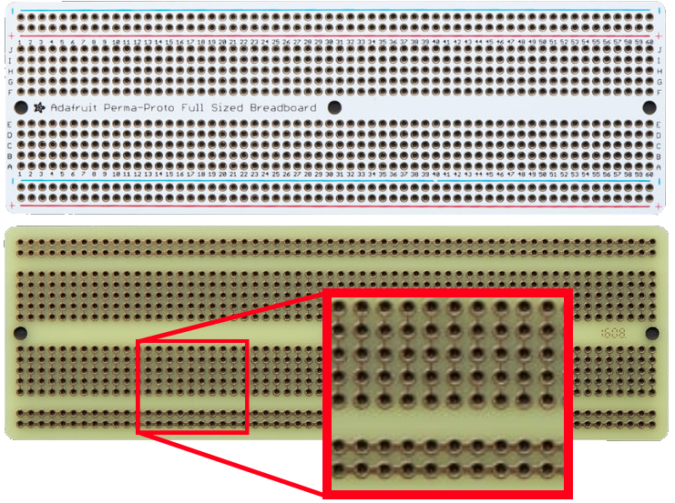
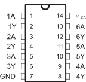
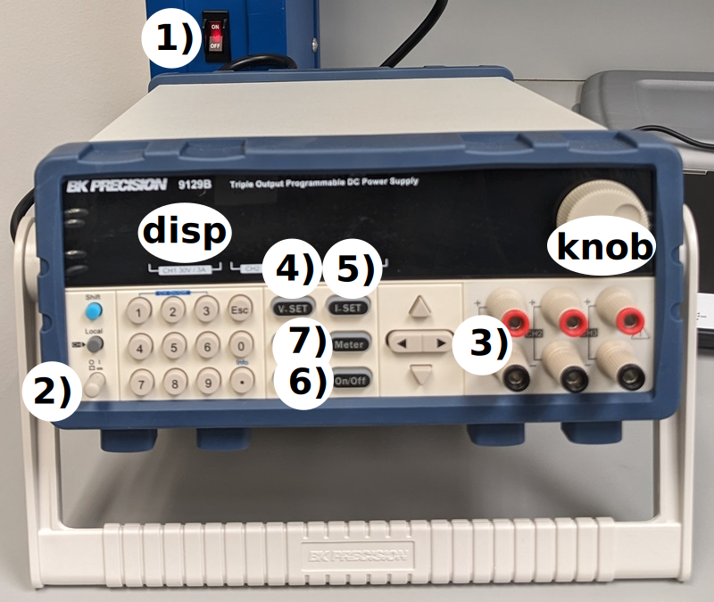

# Familiarization Lab: Digital Logic and Breadboarding

In this familiarization lab you will create the digital logic circuit you developed during class. 

## Objective

Illuminate an indicator if:

- one (and only one) spacecraft from plane 1 is in view
  
  AND

- one (and only one) spacecraft from plane 2 is in view

## Hardware

- solderless breadboard
- LED
- resistor
- ICs (integrated circuits, aka chips)
  - OR
  - AND (2x)
  - NOT (i.e. inverter)
- jumper wires
- benchtop DC power supply

## Documentation

Refer to the provided datasheets for each IC type. 

## ESD

Electrostatic Discharge (ESD) is the release of stored static  electricity. This discharge can consist of many thousands of volts. Discharge through an electronic device can cause catastrophic failure in the part or even latent defects that will cause a failure. 

| **Means of Generation**   | **10-25% RH** | **65-90% RH** |
| ------------------------- | ------------- | ------------- |
| Walking across carpet     | 35,000V       | 1,500V        |
| Walking across vinyl tile | 12,000V       | 250V          |
| Worker at bench           | 6,000V        | 100V          |

When possible, you should wear a connected ESD bracelet while you handle electronic components—even when they are unpowered.

You will always follow this rule with FalconSAT. In Astro 331 it will not always be possible. 

## Connections

A solderless breadboard enables rapid prototyping and provides the ability to instantly connect electronic components by inserting them. They can also be removed easily. 

Components are connected by wires, but the breadboard itself also provides some connections. This image of a solderable breadboard shows how the points are connected. Each set of five points in the middle of the board is connected (for example, A1-B1-C1-D1-E1). In addition, the four long strips along the side of the board are connected. These strips are usually used for power and ground. 

The breadboard for this lab already has four IC chips installed. You will connect them to complete the logic circuit. 

| OR                    | AND                     | NOT                     |
| --------------------- | ----------------------- | ----------------------- |
|  |  |  |

## Power

You will power your circuit with a benchtop DC power supply. 

1) ensure the power strip is on
2) turn on the power supply
3) connect your breadboard to Channel 1 power and ground using the red and black banana plug cables
4) press V. SET and adjust output to 5V (using the knob and Channel 1 display)
5) press I. SET and set a current limit of 0.5A (using the knob and Channel 1 display) 
6) energize your circuit by pressing On/Off button
7) you can monitor circuit power by pressing the meter button

## LEDs

LEDs (light emitting diodes) illuminate when current flows through them. If connected directly to a voltage source, they will burn out immediately—they must always be connected in series with a resistor, which will limit the current. 

In addition, LEDs are directional—the longer leg (or bent leg) must be connected to power, and the shorter leg to ground. Connecting the LED backwards won't damage anything, but the LED will not illuminate. 

## Procedures

Install the ground and power wires as shown in red and green. 

- Short wires are better—they will stay out of the way when you add more wires later. 

- Wire color has no effect electrically. However, to avoid confusing yourself later, it is often helpful to use green wires for ground and pick a color such as red for 5V power.  
  
  Connect the LED and resistor—this is your circuit output. 

Connect jumper wires to form your logic circuit. 

Connect input wires as shown in yellow. You can use this area to send inputs to multiple places. 

- As shown, all of F3–J3 are connected to input A. You can use these points to run inputs to various points in your circuit. 
- Connecting an input to 5V represents TRUE
- Connecting an input to ground represents FALSE

When you have completed your logic wiring, connect the breadboard to a 5V power supply. Move the wires to provide different input combinations and verify your output matches your predictions. 

## Post-lab procedures

Note any discrepancies in your lab notebook. If there were none, note that fact. 

Turn off your power supply and multimeter. Remove the wires, LED, and resistor from your breadboard. 
