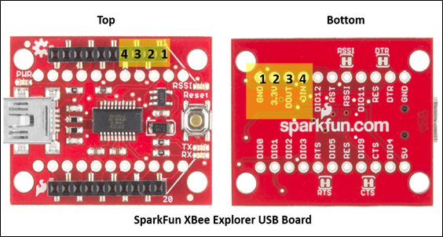

# Lab 3: communication

In this lab you will build FlatSAT's communication system including the onboard radio, antenna, and ground station. You will test communication and measure signal strength at multiple link distances to characterize the link budget and ensure FlatSAT has sufficient link margin to communicate from orbit. 

In this lab one laptop will serve as FlatSAT's ground station. The ground station computer will send commands to the spacecraft over an XBee serial link. 

One additional laptop is required to power FlatSAT. 

prelab report instructions: [https://www.overleaf.com/read/qksywqwkjcqb#3d1ec1](https://www.overleaf.com/read/qksywqwkjcqb#3d1ec1)

## equipment

- 2 laptops (one simply provides power to FlatSAT via USB)
- micro USB cable
- ruler and measuring tape

## hardware

- FlatSAT
  
  - components from previous labs
  - XBee radio with integral PCB antenna
    - on Explorer adapter board
  - laptop for USB power

- ground station
  
  - laptop with serial terminal (Tera Term)
  - XBee radio with RP-SMA RF connector
    - on USB Explorer adapter board
  - 2x antenna (2 different lengths)

- LED and 220 Ω resistor

## software

- Arduino IDE

- Arduino SAMD drivers (already installed)

- `Tera Term` serial terminal program
  
  - install if necessary: website or command line
    - [https://github.com/TeraTermProject/teraterm/releases](https://github.com/TeraTermProject/teraterm/releases)
    - `winget install teratermproject.teraterm`

- `03_communication.ino`

## lab report

instructions: https://www.overleaf.com/read/qksywqwkjcqb 

## overview

In this lab the XBee–XBee link will act as a wireless serial connection. 

Ground-to-space communication:


After receiving a command, FlatSAT will produce a response and return it to the ground station using the same link in reverse. 

The radios need to be programmed with compatible parameters (channel, etc.) before they can communicate. In this lab the ground station radio is programmed once using AT commands sent from the ground station serial terminal. You will modify your Arduino (once) code so that each time FlatSAT reboots it will program the radio. 

Each XBee radio maintains a record of the signal strength of the last message it received. An RSSI query from the ground station involves the following steps:

- query message from ground station via XBee to FlatSAT
- (FlatSAT XBee keeps record of the query message’s RSSI since it is the latest message)
- Arduino asks FlatSAT XBee for RSSI
- FlatSAT XBee responds in hex format
- Arduino converts response to ASCII decimal format
- Arduino sends RSSI string via XBee to ground station

## setup

- connect XBee radio to FlatSAT
  
  - as listed in `xbee_pins.h`

- Add LED and 220 Ω resistor 
  
  - as listed in `LED_pins.cpp`
  - LEDs are directional—short leg of LED connects to ground through resistor
  - LEDs will burn out without a resistor


### XBee breakout

The XBee radio communicates with Arduino using serial communication. Serial communication uses two wires: transmit and receive. 



## Pair radios

Pair your radios. Your radios must be configured with matching parameters. 

You will configure your radios one at a time. 

1. Connect the XBee breakout board to your computer via USB

2. change terminal settings
- Setup -> Terminal
  - New-line: Receive: Auto
  - Local Echo: Yes
  - OK
- if necessary, configure the serial port
  - speed: 9600
  - data: 8 bit
  - parity: none
  - stop bits: 1 bit
  - flow control: none
3. connect to the correct serial port (COMX) in Tera Term
   
   - you can view the COM port number in Arduino IDE or in Device Manager

To configure a radio you must enter AT command mode. When entering data into a serial terminal, the backspace key counts as a key and does not delete the previous keystroke. If you make a mistake, wait and try again. 

To enter command mode: 

- type nothing for 1 second

- type `+++` (do not press Enter)

- type nothing for 1 second

The local radio will reply `OK`. You are now in command mode. Command mode will timeout after 10 seconds of inactivity. 

4. enter command mode

5. enter relevant configuration commands (see table below). 
   
   - NOTE: **DO** press `Enter` after entering an AT command
   - EXAMPLE: you are programming the ground station with network ID 2006
     - `ATID 2006↵`
       - (radio responds `OK`)
     - `ATDH 0↵`
     - etc. 

|                                      | AT command | ground station | FlatSAT | note                                                                                                                                                                                                                                  |
| ------------------------------------ | ---------- | -------------- | ------- | ------------------------------------------------------------------------------------------------------------------------------------------------------------------------------------------------------------------------------------- |
| network ID                           | ATID       | match          | match   | 4-digit number between 0000 and 9999---deconflict with other groups                                                                                                                                                                   |
| destination address (of other radio) | ATDH       | 0              | 0       |                                                                                                                                                                                                                                       |
|                                      | ATDL       | 0              | 1       |                                                                                                                                                                                                                                       |
| radio address                        | ATMY       | 1              | 0       | ATDL radio 1 = ATMY radio 2                                                                                                                                                                                                           |
| baud rate                            | ATBD       | 3              | 3       | 3 = 9600 bps<br/>see [documentation ](https://www.digi.com/resources/documentation/Digidocs/90001477/reference/r_cmd_bd_xtend.htm?TocPath=AT%20commands%7CSerial%20interfacing%20commands%7C_____1) for other data rates if necessary |

6. `ATWR` save current configuration to radio memory

7. `ATCN` to immediately exit command mode (or wait 10 seconds). 

Switch radios (can use the same explorer breakout board) and repeat steps 4 through 7. 

Use a label maker to label the ground station radio with your group's name. 

## Setup the ground station

- If your FlatSat radio has an RP-SMA connector, attach a small antenna to it.


- open `Tera Term` and connect to the ground station XBee 

## Program FlatSAT

- Connect FlatSAT to a PC with Arduino IDE installed
- Connect ground station radio to the same PC
- Open `lab_03_communication.ino`
- From the tools menu, select the correct board (MKR Zero) and port
- Upload code to FlatSAT

## test link

FlatSAT and the ground station should now be connected and communicating. Restart FlatSAT (the small blue button on the Arduino). The terminal on the ground station PC should display a welcome message. If not, reopen your serial connection and restart FlatSAT. 

If the link doesn’t work, connect to FlatSAT with the serial monitor and look for error messages. 

(You should start to see messages from Arduino. If they end with “ Received: OK and 0 0” then you are good to go. If the messages continue to autoscroll without stopping, you will need to disconnect your USB cable from your laptop and close the serial monitor. Then you will need to re-connect the USB cable to your laptop and re-open the serial monitor. If you do not get the “OK” message in the serial monitor the second time, double-check that you connected all of the wires correctly.)

## Sending and Receiving Data

FlatSAT responds to the following commands. 

```
1 help
2 get RSSI
3 toggle LED
```

- Type 3 to toggle the LED. 
- Type 2 to get XBee’s current RSSI. 
- collect RSSI values at the following distances

| distance (m) | RSSI (dB) |
| ------------ | --------- |
| 0.5          |           |
| 1            |           |
| 2            |           |
| 5            |           |

At each distance, also toggle the LED. 

Next, repeat the RSSI measurement at 5 m with a different size antenna. Record this RSSI value and the antenna change. 

Finally, see how far FlatSAT can communicate. If you go outside, call your teammate on the telephone to establish out of band communication. Record your RSSI at distance and use https://gmap-pedometer.com/ to determine your separation. 

## Lab station cleanup

- Disconnect devices from all computers
- Remove the ESD wrist straps and replace them in the bag at your lab station.
- Replace all items at your lab station the way you found them. 
- Have your instructor check off your lab station before you depart.

## End of course cleanup

NOTE: If you change xbee baud rate or channel during this class, you must remember to return it to default configuration at the end of the class. 

To enter command mode:

- type nothing for 1 second

- type `+++` (do not press Enter)

- type nothing for 1 second

The local radio will reply `OK`. You are now in command mode. Command mode will timeout after 10 seconds of inactivity.

4. enter command mode

5. enter relevant configuration commands (see table below).
   
   - NOTE: **DO** press `Enter` after entering an AT command

|                                      | AT command | ground station | FlatSAT | note                                                                                                                                                                                                                                 |
| ------------------------------------ | ---------- | -------------- | ------- | ------------------------------------------------------------------------------------------------------------------------------------------------------------------------------------------------------------------------------------ |
| network ID                           | ATID       | match          | match   | 4-digit number between 0000 and 9999---deconflict with other groups                                                                                                                                                                  |
| destination address (of other radio) | ATDH       | 0              | 0       |                                                                                                                                                                                                                                      |
|                                      | ATDL       | 0              | 1       |                                                                                                                                                                                                                                      |
| radio address                        | ATMY       | 1              | 0       | ATDL radio 1 = ATMY radio 2                                                                                                                                                                                                          |
| baud rate                            | ATBD       | 3              | 3       | 3 = 9600 bps<br>see [documentation](https://www.digi.com/resources/documentation/Digidocs/90001477/reference/r_cmd_bd_xtend.htm?TocPath=AT%20commands%7CSerial%20interfacing%20commands%7C_____1)  for other data rates if necessary |

6. `ATWR` save current configuration to radio memory

7. `ATCN` to immediately exit command mode (or wait 10 seconds).

Switch radios (can use the same explorer breakout board) and repeat steps 4 through 7.
