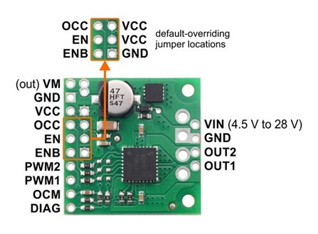
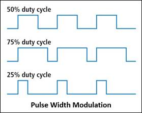

# Lab 4b: attitude control

In this lab you will integrate FlatSAT’s attitude control system. You will suspend FlatSAT from a string and change its orientation by varying the speed of the reaction wheel. (FlatSAT's design calls for 3 reaction wheels but you will only test 1.) You will measure system performance to ensure that FlatSAT can meet orbital torque and momentum requirements. 

You already submitted the prelab report for this lab. 

## rotor mass properties

Measure the diameter and mass of the reaction wheel. There is a spare rotor and a scale on the filing cabinets near the door. Use these values to calculate momentum storage and compare your predictions to measurements. 

## equipment

- 1 laptop
- micro USB cable 
- string
- tachometer

## hardware

- FlatSAT
  - components from previous labs
    - SD card must be inserted
  - replace red IMU with an Adafruit BNO055 (black IMU)
  - TB9051FTG motor controller (green PCB)

## documentation

- motor datasheet (Pololu 37D metal gearmotor)
- motor driver datasheet (Pololu TB905FTG motor driver carrier)
- IMU datasheet (SparkFun 9DoF IMU)

## software

- Arduino IDE

- Arduino SAMD drivers (already installed)

- ensure the following Arduino libraries are installed 
  
  - Adafruit BNO055 (that's a letter O followed by the number zero)
  - TB9051FTGMotorCarrier
  - QuadratureEncoder
  - EnableInterrupt

- `04b_attitude_control.ino`

## setup

For today’s lab, FlatSAT will be powered by a 12 V lithium ion battery. The motor driver and motor are powered directly from the battery’s 12 V supply. The Arduino itself is powered via a 12 V $\rightarrow$ 5 V BEC (battery eliminator circuit). Everything else is powered by Arduino’s Vcc pin (3.3 V). 

Copy the setup below, but **do not place the 3rd (middle) cell into the battery holder yet**. 

- add the motor driver (green square) 
  - connect to Arduino and motor
  - follow pin/color definitions in `motor_setup.h`
    - There are 3 sections in `motor_setup.h`:
    - motor driver high side (4 pins on 12 V side, shown on right below)
    - motor driver low side (6 pins on 3 V side, show on left below)
    - motor connections

### motor driver

FlatSAT controls a brushed DC motor via a Toshiba TB9051FTG brushed motor driver. The motor driver provides 0–12 V to the motor, modulated to control motor speed. The modulation is controlled by a 3V pulse PWM (pulse width modulation) signal from the Arduino. The higher the PWM command, the faster the motor will spin.

The motor has a hall effect quadrature encoder. FlatSAT uses information from this sensor to identify motor speed. 

### motor

FlatSAT's reaction wheel motor is a metal gearmotor (Pololu item 4758). 

- gear ratio: 10:1
- voltage: 12 V

The motor has a 6-wire connector with 2 wires each for motor power, speed encoder power, and encoder output. Connect it to FlatSAT. 

### LED indicator

place an LED on pin A0 and connect it to ground via a resistor—the short leg must connect to ground. 

- same wiring as in communication lab

**NOTE: do not insert the center battery cell yet.**

## magnetometer calibration

Ideally you could use the gain and bias values you found using data from lab 04a to calibrate your magnetometer. Unfortunately, your magnetometer has likely drifted so far that the previous calibration is unusable. 

We are going to give up and use an IMU that calibrates itself. 

## test reaction wheel

Disconnect FlatSAT from USB. Place it on the reaction wheel platform, suspend it from the hook in a flat attitude. Connect the battery. 

FlatSAT will rotate back and forth over the course of 40 seconds. Use the first 15 seconds to steady FlatSAT with your hands. You want it to be as motionless as possible. 

Watch FlatSAT rotate as the wheel speed changes. After 40 seconds the wheel will stop. Allow FlatSAT to spin freely through at least 3 revolutions. 

Disconnect the battery. 

## Lab station cleanup

- Transfer saved data to your group's storage location
- Disconnect devices from FlatSAT and all computers
- Remove the ESD wrist straps and replace them in the bag at your lab station.
- Replace all items at your lab station the way you found them. 
- Close Arduino IDE, and log out of the laptop.
- Have your instructor check off your lab station before you depart.

## Post-lab data analysis

Use your measured mass properties and the provided max speed/acceleration data (`max_speed.csv`, located in the 04a folder) to determine reaction wheel torque. 

Use your recorded attitude data to determine the MOI of the entire FlatSAT assembly. Do this with the wheel speed data and IMU data immediately before and after the wheel turned off. 

Include graphs of IMU data (magnetometer AND rate gyro) in your final report. 
